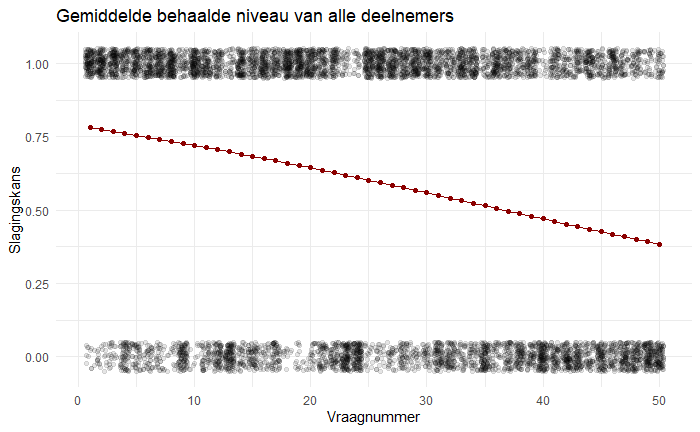

[github link](https://github.com/Dennis-2026/wetenschappelijke_cyclus_onderzoek)

```{r setup, include=FALSE}
knitr::opts_chunk$set(echo = TRUE)
```

## Introductie

De Duitse taalbeheersing onder Nederlanders neemt af, met een daling in eindexamens Duits van circa 68.000 in 2018 naar 49.000 in 2025 (−23%). Ook in het hoger onderwijs is een vergelijkbare terugloop zichtbaar. Mogelijke oorzaken zijn een curriculum dat vooral focust op technische taalvaardigheden, ten koste van motivatie en culturele context. Dit onderzoek bekijkt hoe goed Nederlanders Duits beheersen en welke factoren daarbij een rol spelen, met focus op leeftijd, opleidingsniveau en woonlocatie (grensregio vs. Randstad). Verwacht wordt dat oudere generaties, hoger opgeleiden en inwoners van grensregio’s beter scoren. Hiervoor wordt een kwantitatieve studie uitgevoerd met een CEFR-gebaseerde taaltoets en een achtergrondvragenlijst, waarna de resultaten per groep worden vergeleken.

### 20/05/26

Start logboek, we hebben voor vandaag afgesproken voor de kopjes introductie, methoden en materialen een eerste versie af te maken. We gaan vandaag individueel ontdekken wat voor figuren we willen genereren met R.

Ik heb de taak op mij genomen om het excel bestand wat uit de Forms kwam op te schonen aangezien daar niet gemakkelijk juiste/onjuiste antwoorden uit kwamen helaas. Dit hield in dat ik alle antwoorden in een aparte regel zet en daar de antwoorden van de respondents mee vergelijk in een aparte sheet en de rest van de form overneem in de resultaatsheet. Ik heb voor de formules ChatGPT gebruikt:

`{=--(TRIM(LOWER(Sheet1!Q4))=TRIM(LOWER(Sheet1!Q$1)))}`

<details>

<summary>*promts used:*</summary>

> i exported a excel doc from forms which doesnt contain right/wrong answer instead it contains the full answer. How can i convert these into true/false values?

> ok, i put all answers in the top row, i skip a couple of cells because they are not test answers rather background info. the test starts from column AR and ends at Gi. in between of those columns there are columns that contain "Points - {question}" and "Feedback - {question}" which i want removed.

> id rather have it different, i have answers in row 1, headers in row2, 3-156 are student answers

> ok yeah i want it in the same sheet but i cant remove the points, feedback : it just gives me back columns with "column1", "column2" etc

> so i put this: =--(TRIM(LOWER(AR3))=TRIM(LOWER(AR\$1))) into the same cell that already holds an answer?

> ok, yeah seperate sheet it is; also answers start from Q now

</details>

### 21/05/26

Ik was vandaag iets te laat bij de workshop schrijven van Dave, gelukkig denk ik dat ik wel prima schrijf. Dus maar zelfstandig bezig. Ik heb het logistic regression voorbeeld wat Emile gister op brightspace had gedeeld gedownload, en probeer nu het model toe te passen op ons dataset. Daarvoor heb ik een testbestandje gemaakt in de repo waarin ik de csv inlaad en daar wat mee ga prutsen.

Het wil allemaal niet echt, het voorbeeld is erg specifiek en onze data is heel anders. Ik heb eerst onze kolomnamen veranderd naar kortere namen aangezien daar hele vragen in stonden.

Daarna heb ik de df gepivot met tidyr zodat de vragen en antwoorden er apart in stonden. Daarna heb ik chatgpt geraadpleegd omdat ik het lastig vond het voorbeeld toe te passen op onze data. Uiteindelijk wel een mooi model en grafiekje erbij.

### 22/05/26

Vandaag 8:30 begonnen, Dave was daar blij mee. Ik realiseerde mij gister nog dat het logistic model wat ik gister had uitgewerkt alleen op het totaalplaatje slaat (zie figuur onder). Dus het vertelt alleen hoe moeilijk elke vraag bevonden is (kans op goed hebben). Dit geeft geen info over het niveau van een individu zelf, dus ik wil graag vandaag proberen om dat te gaan doen en om dan ook onze data aan te passen met nieuwe kolommen voor het niveau/score (2 zodat we een catagorische niveau hebben en een numerische score).



Het is inmiddels gelukt, ik met wat hulp van NotebookLM Item Response Theory geimplementeerd met de library MIRT. Item Response Theory is een model wat vaak wordt gebruikt in educatie en psychologie en geeft per persoon een score die gemakkelijk kan worden omgezet naar CEFR[@Krabbe2017].

<details>

<summary>*promts used:*</summary>

> I dont understand the logistic regression and the way it is implemented here. Also, this model is based on all answers which means we cant find the level of an individual easily.}

> So, i am not very indulged in R so can you just go through the steps for the current implementation a bit deeper and after that we can look at using MELR or IRT.

> ok, aside from limited R experience i think i understand now. Since you said IRT i think that is a good direction to follow. However, i want to add some context: this is concerning a dataset where the first couple of columns are background questions (e.g. how far do you live from ..) and from V17 it starts a language proficiency test. our goal is to not only generate an arbitrary score for each individual but also link their score to a CEFR level for catagorical labeling

> ok, walk me through the implementation and also: i need to manipulate my inital dataset to include the columns (CEFR, score) which means i want a catagorical cefr level per person and a mathematically easy numerical score aswell for calculations. also, when i have that i want to remove the initial v17-v66 columns and output a cleaned csv for analysis.

> example: teammate made a graphical representation of level with logistic regression but there are some differences between our results. i tamper with the numbers but they have exclaimed that i should use a threshold to measure if CEFR levels have been accomplished

> walk me through this please

</details>

voorbeeld (shortened names):

| ... | int taal | int duits | belang duits | eig schatt |        score | CEFR |
|-----|:---------|:----------|:-------------|-----------:|-------------:|:-----|
| ... | ja       | nee       | ja           |          1 | -1.160389810 | A1   |
| ... | ja       | nee       | ja           |          2 |  0.310393979 | B1   |
| ... | ja       | nee       | nee          |          2 | -1.674543131 | A1   |
| ... | ja       | nee       | nee          |          2 | -0.191005321 | B1   |

Vani heeft ook geprobeerd dit te tackelen en heeft een mooie visuele representatie van de niveaus, in combinatie is dit erg handig denk ik dus we beide implementaties houden voor nu.

Ik heb nog thresholding toegevoegd aan de scoring, nu moet iemand 60 % goed hebben (volgens CEFR regelgeving). Vani en mijn approaches verschillen nog wel wat. Dus dat proberen we te verhelpen, maar ik weet niet waar het probleem nu nog moet liggen - zeker niet met de nieuwe thresholding die gebaseerd is op alle antwoorden ipv random waardes te kiezen:

```{r, eval = F}
prob_target <- 0.60
logit_add <- log(prob_target / (1 - prob_target))

            ...
            score < threshold_A2 ~ "A1",
            score >= threshold_A2 & score < threshold_B1 ~ "A2",
            score >= threshold_B1 & score < threshold_B2 ~ "B1",
            score >= threshold_B2 & score < threshold_C1C2 ~ "B2",
            score >= threshold_C1C2 ~ "C1/C2",
            ...

```

We hebben bij statistiek vanmiddag nog met Emile gesproken en besloten om inderdaad beide approaches te houden, elk heeft zijn voordeel: LogReg geeft meer toepasselijke score, IRT gemakkelijker uit te lezen en relatief. Uit beide kunnen we goede resultaten halen. De resultaten verschillen overigens gewoon omdat het verschillende modellen zijn, dat maakt in principe niet uit.

### 25/05/26

In het weekend was het het plan om een scatterplot te maken van beide implementaties door Dennis, maar dat is niet gelukt helaas dus we lopen nu weer achter op schema. Ik heb daardoor eigenlijk geen idee wat ik nu kan doen omdat het probleem niet bij mijn implementatie lag. Ik denk dat ik vanochtend vooral ga werken aan mijn eigen journalclub presentatie.

Ik en Vani hebben nog deel 3 van de FAIR-checklist ingevuld.

#### Wat ik vandaag nog ga doen:

- Ik ga het artikel nog een keer lezen, vorige keer heb ik meer globaal gelezen dus ik wil nu alle details meenemen.
- Ik ga de supplementary info bekijken om te zien of daar nog iets interessants of ondersteunends in staat.
- Ik ga de basis van mijn presentatie leggen (num dias, inhoud, volgorde, etc.).
- Ik ga ondersteunende bronnen zoeken voor de uitleg.

### 26/05/26

Ik heb de presenatie grotendeels klaar, ik wil mezelf nog iets beter voorbereiden qua tekst.

#### Wat ga ik vandaag doen:

- Presentatie klaar maken voor inleveren (en inleveren).
- Steekwoorden/scriptje maken voor presentatie.

#### Wat heb ik gedaan:

- Ik heb de presentatie klaar gemaakt en ingeleverd, qua script geloof ik het wel - niet meer gedaan.

### 28/05/26

Ik ga voor gemak notities in de powerpoint zetten, zodat ik die tijdens de JournalClub ook kan raadplegen.

#### Wat ga ik vandaag doen:

- Notities in de powerpoint om te raadplegen tijdens presentatie.
- Testen of ik de notities van afstand kan lezen..
- Nadenken hoe ik mijn laptop ga neerzetten (ik denk net zoals die personen van de avg presentatie, zodat ik de notities wel kan zien en het publiek niet, thanks avg mensen :) )

#### Wat heb ik gedaan:

All of the above \^, toch niet heel serieus. Gister werd gezegd dat het toch vooral om resulaten v.d. paper gaat dus ik zwak een beetje af qua uitleg - scheelt ook weer werk.

### 29/05/26

Vandaag Alphafold presenteren voor de JournalClub.

#### Wat ga ik doen vandaag:

- Presenteren
- Naar huis, want mooi weer.
- Misschien nog even wat werk delegeren voor ons groepje, we lopen eigenlijk al even niks te doen en dat eet toch tijd weg.

#### Wat heb ik gedaan:

- Alphafold gepresenteerd, ging prima denk ik. Ik ben hier en daar wel wat details vergeten, maar het gaat om de resultaten dus dat is ok.

- Heb gezegd in de WhatsApp van ons groepje, de casual vorm van onze teams, dat het mij een goed plan lijkt om allemaal even individueel te kijken waar we een visualisatie van willen maken en dat in de Teams te zetten. Daarnaast heb ik gezegd dat we ~mijn~ methode voor scoring maar gaan gebruiken, anders blijven we te lang wachten terwijl er in principe al een dataset met kolommen voor score klaarligt. Uiteindelijk maakt het i.m.o. niet veel uit, wij kiezen voor deze methode - een andere researcher misschien voor een andere. Het wordt wel vermeldt in onze methodologie.

<details>

<summary>*Appjes:*</summary>

> Vani: ...

> Jesse: "Ja hoor, ik stel voor dat we van nu tot maandag even gaan nadenken over waar we grafieken over willen maken/ wat we willen vergelijken. Dan kunnen we volgende week gewoon alleen schrijven bijna.. Ik maak wel zo'n thread aan in teams waar dat in kan."

> Vani: "Is helemaal goed hoor"

</details>

------------------------------------------------------------------------

- Logboek bijgewerkt :)

### 31/05/26

#### Wat ga ik vandaag doen:

- Aantal suggesties voor wat we kunnen gaan visualiseren in de teamsthread zetten.
- Volgorde van paper schrijven beetje vastleggen via de volgorde van de suggesties.
- verwijderen excel remnant van editen (\~filename ding).

------------------------------------------------------------------------

Niemand anders heeft nog suggesties erin geplaatst, niet heel erg. Nu kan ik een beetje sturen waar het heen gaat en ik denk dat ik daar voorkeur aan heb dan dat iedereen door elkaar heen suggereert.

Ik laat mij een beetje sturen door AI, heb gevraagd wat een goede volgorde is voor de paper/visualisaties en daaruit ook mogelijk te vergelijken variabelen meegenomen.

#### Wat heb ik gedaan:

- Suggesties gemaakt (zie summary onder).
- Volgorde van paper schrijven vastgelegd d.m.v. volgorde suggesties.
- Excel remnant verwijderd.

<details>

<summary>*suggesties*</summary>

1.  **Beschrijven resultaten:**

- Aantal respondenten

- verdeling leeftijden

- verdeling opleidingen

- verdeling afstand grens

- verdeling niveaus (bar plot)

- gem theta score (irt) (histogram miss normaalcurve te zien) (theta score p leeftijdsgrp boxplot?)

2.  **Hoofdvraag antwoorden:**

- Gemiddelde niveau per leeftijdsgroep (tabel: groep, gem theta, SD, gem CEFR, irq/1.349?)

- percentage niv x per leeftijdsgroep (tabel: groep. A1, A2, ..)

3.  **hypotheses testen:**

- Vergelijk gem score (theta wss) per groep met t-toets?
- geef terug: gemiddelden verschil p-waarde effectgrootte (Cohen's d)
- vb voor res: De gemiddelde theta-score van de groep 40+ (M = 0.41) was significant hoger dan die van de groep 18–39 (M = -0.12), t(154)=3.52, p\<0.001, d=0.56.

4.  **Locatie:**

- d_grens categoriseren in stukjes van x km
- gemiddelde score vs afstand correlatie (pearson/spearman) onderzoeken (scatterplot?)

5.  **onderwijs:**

- oplniveau vs score/cefr

6.  **blootstelling duits:**

- woon/werk vs score
- fam/kennis vs score
- gebruik vs score

7.  **situaties:**

- frequentie (percentages) staafdiag 2 staven per categorie voor elke leeftijdsgroep
- (misschien) vergelijken welke situatie het niveau meest bevorderd (per leeftijdsgroep)

8.  **belang v duits:**

- vinden ouderen belangrijken dan jongeren? ja/nee idk staafdiag denk ik?

9.  **schatting vs werkelijke score:**

- correlatie schatting vs score (tabel of gestapelde staafdiag?)
- wie onderschat/overschat meest

10. **regressie?**

- welke variabele heeft meest impact op niveau (wel interessant)

</details>

---

### 01/06/26

#### Wat ga ik vandaag doen:

- Taken verdelen
- Publicatie start maken in Rmd (docx overzetten naar Rmd)
- beginnen aan mijn deel

#### Wat heb ik gedaan vandaag:

We hebben de taken verdeeld, en ik ga de volgende dingen doen:
- Beschrijven resultaten
- Hypotheses testen
- Regressie (welke var heeft meeste impact)

Ik heb de paper tot zo ver in Rmd gezet met het overnemen van een template van vorige jaren. (thanks Yamila Timmer, Tai Vo, Mirte Draaijer)


