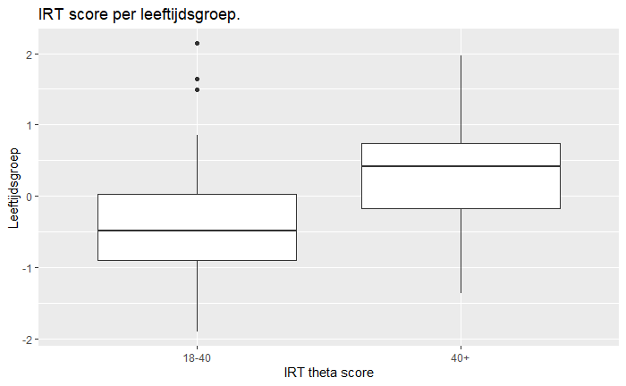

```{r setup, include=FALSE}
knitr::opts_chunk$set(echo = TRUE)
```

## Hello, hypothese testen en hoofdvraag antwoorden is bijna zelfde behalve dat ik meer statistisch moet vertellen en jij alleen het resultaat moet uitleggen en uitbreiden.

Dus bij deze een paar resultaten:

### Samenvatting aantal mensen, mean score, sd op score, gem niveau:


### shapiro test (hoe normaal zijn de 2 groepen)

Als je niet snapt gebruik claude ofzo, je hoeft niet helemaal uit te leggen want dat doe ik sowieso later al.

Shapiro-Wilk normality test

data: data$score[data$leeftijd == "18-40"] W = 0.95872, p-value = 0.02421

```         
Shapiro-Wilk normality test
```

data: data$score[data$leeftijd == "40+"] W = 0.98715, p-value = 0.5574

### Ttoets resultaten (hoe verschillend zijn onze groepen):

Welch Two Sample t-test

data: score by leeftijd t = -5.9697, df = 136.72, p-value = 1.938e-08 alternative hypothesis: true difference in means between group 18-40 and group 40+ is not equal to 0 95 percent confidence interval: -0.9585526 -0.4815244 sample estimates: mean in group 18-40 mean in group 40+ -0.4024519 0.3175866

### Irt score vs leeftijdsgroep:

Deze is het belangrijks i guess



### Effectgrootte:

## Cohen's d \| 95% CI

-0.98 \| [-1.32, -0.64]

negatieve waarde betekend dat groep 1 slechter scoort dan groep 2, verschil is bijna 1 sd wat behoorlijk is.
