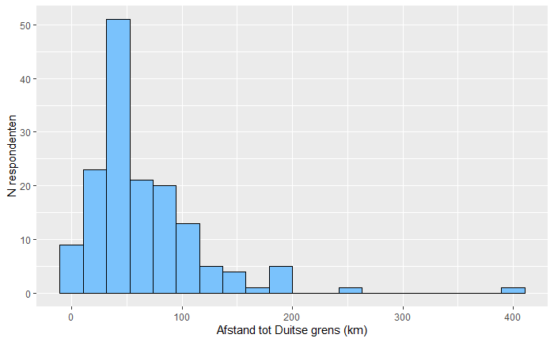
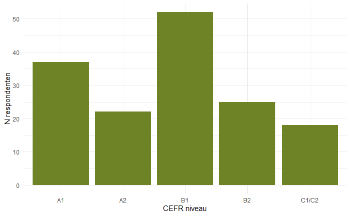
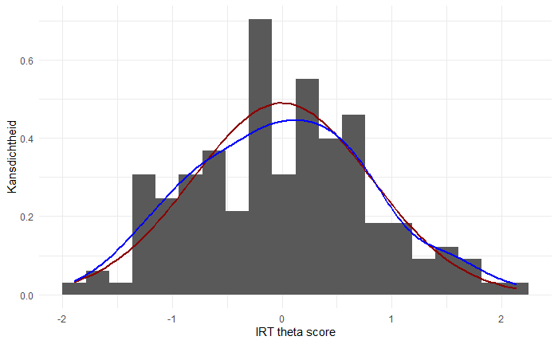
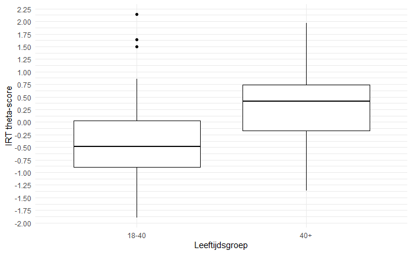

# Introductie

De kennis van de Duitse taal gaat in Nederland al jaren achteruit. Veel scholieren hebben zelfs na hun eindexamen een laag niveau Duits. Ook is de interesse in de Duitse taal niet hoog onder jonge mensen in Nederland. Het aantal studenten van Duitse Taal aan universiteiten is al jaren aan het dalen. Wij vermoeden daarom dat het niveau Duits onder jongeren lager is dan dat van oudere mensen. Het niveau van Duits (en Europese talen in het algemeen) wordt gemeten aan de hand van de CEFR-niveaus. Dit staat voor 'Common European Framework of Reference'. Deze niveaus zijn: A1, A2, B1, B2, C1, C2. Het absolute beginnersniveau is A1 en vanaf daar loopt het op tot het hoogste niveau: C2. Dit laatste niveau wordt ook wel 'near native' genoemd. Wij gaan onderzoeken of het niveau Duits van jonge mensen en oudere mensen van elkaar verschillen.

# Methodologie

## Materialen

Voor dit onderzoek is gebruikgemaakt van een digitale vragenlijst opgesteld in Microsoft Forms. De vragenlijst bestond uit drie onderdelen: een achtergrondvragenlijst, een Duitse leestoets en evaluatievragen met betrekking tot de beheersingsgraad van de Duitse taal. De digitale omgeving maakte het mogelijk om de gegevens automatisch en gestructureerd op te slaan.

Ten behoeve van de dataverzameling zijn A5-posters met een QR-code ontwikkeld, waarmee deelnemers direct toegang kregen tot de vragenlijst. Daarnaast zijn smartphones van deelnemers gebruikt voor het invullen van de vragenlijst. Indien nodig was er een tablet of dergelijk smart-apparaat beschikbaar om de vragenlijst in te vullen.

### Benodigde software

Voor de verwerking en statistische analyse van de onderzoeksgegevens is gebruikgemaakt van de programmeertaal R. Hiermee zijn de verzamelde data georganiseerd, verwerkt en geanalyseerd, en gevisualiseerd.

Er is gebruik gemaakt van verschillende software voor verwerking en analyse:

- Microsoft Forms

- Microsoft Excel

- Rstudio

- R

Bij de analyse met R zijn de volgende libraries gebruikt:

| Library    | Versie | Gebruiksdoel                            |
|------------|--------|-----------------------------------------|
| tidyverse  | 2.0.0  | Filteren en sorteren van de data        |
| ggplot2    | 4.0.3  | Produceren van grafieken                |
| tidyr      | 1.3.2  | Creëren van tidy data                   |
| dplyr      | 1.2.1  | Muteren van dataframes                  |
| effectsize | 1.0.2  | Verkrijgen van effect size voor analyse |
| flextable  | 0.9.11 | Exporteren dataframes naar PNG          |
| mirt       | 1.46.1 | Implementatie Item Response Theory      |

## Methoden

### Doelgroepbepaling

Om de betrouwbaarheid van de resultaten te waarborgen, is er voorafgaand aan het experiment een screening uitgevoerd onder de potentiële deelnemers. Hierbij werd bekeken of de deelnemers voldeden aan de volgende specifieke criteria:

- Deelnemer is minstens ouder zijn dan 18 jaar en heeft een schoolopleiding afgerond.

<!-- -->

- Deelnemer moet Duits niet als moedertaal hebben.

<!-- -->

- Deelnemer is minstens langer dan 10 jaar woonachtig in Nederland.

Deelnemers die aan deze criteria voldeden, werden vervolgens geïnformeerd over het doel van het onderzoek en de opzet van het experiment. Daarna werd hen gevraagd of zij wilden deelnemen door de QR-code te scannen.

### Procedure

Nadat de respondent akkoord ging met deelname, werd de vragenlijst in drie onderdelen doorlopen:

- De achtergrondvragen brachten demografische variabelen in kaart.

- De Duitse leestoets bracht een objectieve meting per individu, opgedeeld in secties per taalniveau van het CEFR.

- De evaluatievragen met betrekking tot de beheersingsgraad van de Duitse taal bracht een subjectieve ervaring en zelf ingeschatte beheersingsgraad van de deelnemers in kaart.

Om de motivatie voor de deelnemers te houden en vroegtijdige uitval te voorkomen, was de vragenlijst kort en bondig van opzet. Daarnaast werd vooraf benadrukt dat deelname aan het onderzoek anoniem was en dat "weinig/geen kennis van de Duitse taal" nog steeds een waardevol resultaat oplevert voor het onderzoek. Dit diende om eventuele prestatiedruk bij de respondenten weg te nemen en deelname laagdrempelig te maken.

Na afronding van de dataverzameling is de data opgeschoond in Excel en werden alle antwoorden van de respondenten gefit aan een Item Response Theory model[@Harvey1999], hieruit werd de ervaren moeilijkheidsgraad van de vragen duidelijk. Op basis van de moeilijkheidsgraad zijn dynamisch drempels voor de CEFR niveaus aangelegd, voor het behalen van een CEFR niveau is vastgesteld dat de persoon minimaal 60% van de vragen op dat niveau moet halen. De scores en drempels zijn geschaald aan de ervaren moeilijkheidsgraad van de vragen dankzij het IRT model. De drempels die hieruit zijn gegenereerd zijn als volgt: A1 \< -0.5890936 (A2) \< -0.2340141 (B1) \< 0.4347344 (B2) \< 0.8854923 (C1/2). Deze drempels bepaalden in de verdere analyse het niveau voor een individu op basis van hun theta-score. E.g. theta = 0.44 -\> CEFR = B2 (zie Figuur 4).

Verdere details over de methodologie van dit onderzoek zijn te vinden in de volgende git repository:

[*https://github.com/Dennis-2026/wetenschappelijke-cyclus-onderzoek*](https://github.com/Dennis-2026/wetenschappelijke-cyclus-onderzoek){.uri}

# Resultaten

## Beschrijvende statistiek

In de resultatensectie worden beschrijvende statistieken en afgeleide resultaten gepresenteerd op basis van de dataset van de onderzochte respondenten. De steekproef bedroeg 154 respondenten. De respondenten zijn opgesplitst in 2 leeftijdsgroepen (18-40, 40+) waarvan $\approx$ 44% (N = 68) jonger dan 40 (18-40) tegen $\approx$ 56% (N=86) ouder dan 40 (40+). De meerderheid van de respondenten had een HBO of WO diploma ($\approx$ 31%, $\approx$ 29% respectievelijk). Basisonderwijs was de kleinste groep met $\approx$ 1.3% (N=2) van alle respondenten. Verder bedroeg de gemiddelde woonafstand tot de Duitse grens $\approx$ 65.2km en was de standaard deviatie daarop $\approx$ 51.8km (zie Figuur 1). De initiële verdeling van taalniveau is weergegeven in Figuren 2 en 3. De theta-scores benaderen een normaalverdeling (M = 0.0003, SD = 0.81; zie Figuur 3), wat verder wordt getoetst in [Hypothesetoetsing](#hypothesetoetsing).

{width="400"}

{width="400"}

{width="400px"}

## Hypothesetoetsing

De nulhypothese (H0) stelt dat er geen verschil is in het gemiddelde niveau van Duitse taalvaardigheid tussen personen van 40 jaar en ouder en personen jonger dan 40 jaar.
De alternatieve hypothese (H1) stelt dat personen van 40 jaar en ouder hoger scoren op Duitse taalvaardigheid dan personen jonger dan 40 jaar.

{width="400"}

Om de hypothese te toetsen dat oudere respondenten het Duits beter beheersen dan jongere, werd een onafhankelijke t-toets uitgevoerd op de IRT theta-scores van beide leeftijdsgroepen. Figuur 5 toont de gemiddelde theta-scores per groep. De 40+ groep scoorde gemiddeld hoger (M = $\approx$ 0.32, SD = $\approx$ 0.70, CEFR = B1) dan de 18-40 groep (M = $\approx$ -0.40, SD = $\approx$ 0.77, CEFR = A2; zie ook Figuur 4).

{width="500"}

Shapiro-Wilk toonde een significante afwijking van de normaliteit in de 18-40 groep (W = 0.95872, P = 0.02421; p < 0.05 wat een significante afwijking toont), de 40+ groep vertoonde geen significante afwijking van normaliteit (W = 0.98715, P = 0.5574). Gezien de relatief grote steekproefgroottes (N = 68 en N = 86) en de robuustheid van de t-toets bij lichte afwijkingen van de normaliteit, is de analyse met de onafhankelijke t-toets alsnog uitgevoerd.

De uitgevoerde t-toets toonde een significant verschil tussen beide groepen (t = -5.9697, df = 136.72, p-value = 1.938e-08), het geteste effect (Cohen's d) was bijna 1 Standaard deviatie (|d| = 0.98). Dit komt overeen met een common language effect size (CLES $\approx$ 0.84), wat betekent dat er een geschatte kans van 84% is dat een willekeurig geselecteerde deelnemer uit de 40+ groep hoger scoort dan een willekeurig geselecteerde deelnemer uit de 18–40 groep.

De hypothese wordt ondersteund: oudere respondenten beheersen het Duits significant beter dan jongere respondenten.

